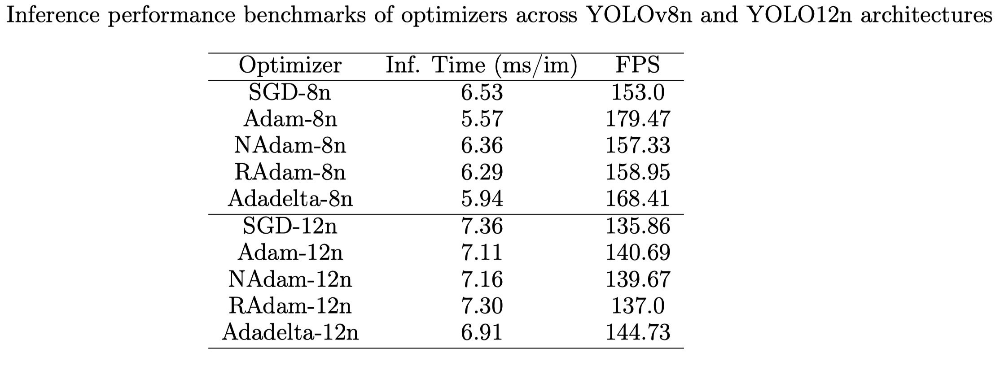
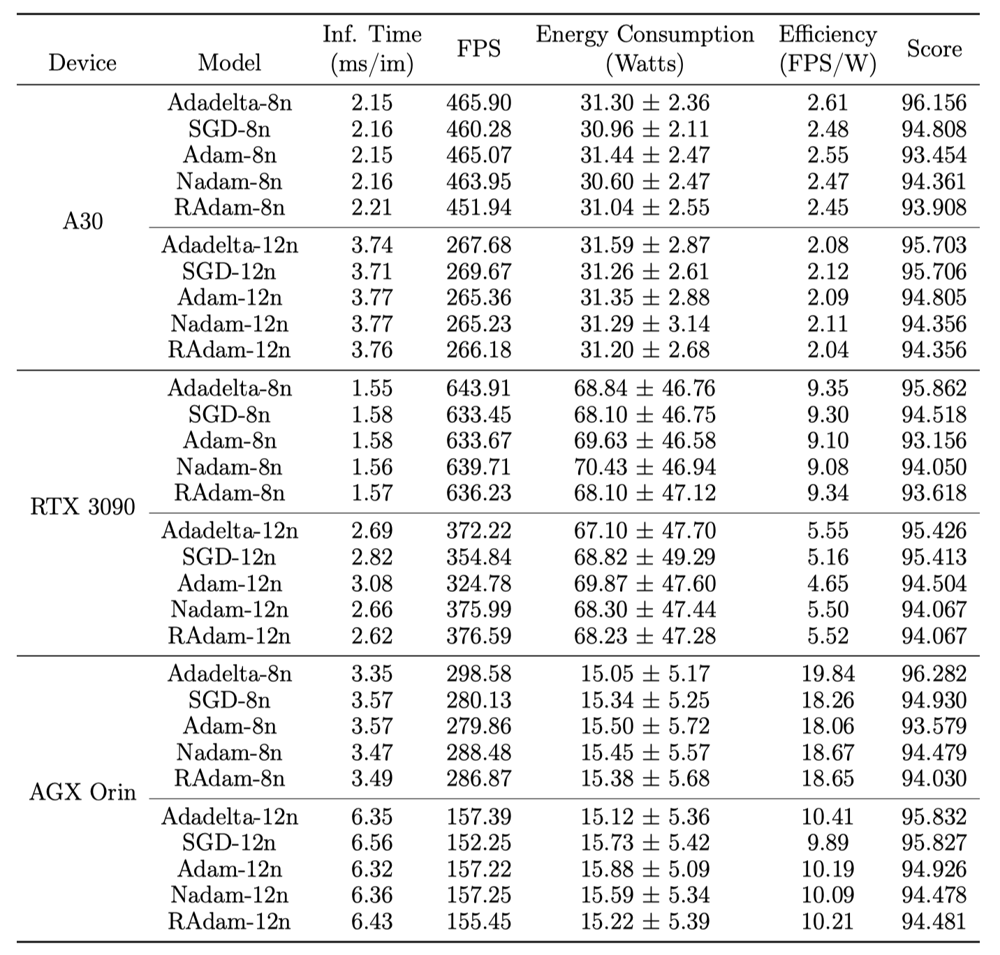

# yolo-optimizer-comparison


This repository presents a comparative analysis of optimizers (**SGD, Adam, NAdam, RAdam, and Adadelta**) applied to **YOLOv8n** and **YOLO12n** architectures in the context of object detection in maritime systems with limited resources, such as **Unmanned Surface Vehicles (USVs)**.  

Key metrics were evaluated: mAP, accuracy, recall, inference time, and power consumption, using heterogeneous GPUs (NVIDIA Tesla V100 and A30) for both training and evaluation, in addition to the Jetson AGX Orin.

Key Findings:    
- **Adadelta and SGD** achieved the best balance between accuracy (**90–92%**), stability, and energy efficiency.  
- The A30 GPU showed 40% more training efficiency compared to the Tesla V100 under the early stopping technique.  
- The **Maritime Operational Efficiency Metric (MOEM)** is introduced, which unifies accuracy, speed, and energy consumption for a comprehensive evaluation.  

These results underscore the importance of optimizer selection and hyperparameter configuration in achieving a balance between **accuracy, stability, and efficiency** in **real-time** maritime applications.


For this study we have followed these steps:

## 1. Installation

### Python dependencies

The best way to install python dependencies is by using a virtual environment, to do so:

```bash
$ sudo apt install virtualenv
$ virtualenv -p python3 venv
$ source venv/bin/activate
$ pip install numpy
```
### Requirements 

To run the code, you will need to install the following dependencies beforehand:

* Ultralytics >=8.3.20
* Python
* Pytorch 
* Clearml 1.18.0 

To deactivate virtualenv, do by:

```bash
$ deactivate
```

## 2. Training

### Dataset structure 

To train the model, a format, in this case YOLOv8, must be followed and the training data set must be divided into three subdirectories.  
The data used to train the custom model in the USV context can be found here: [Datasense@CRAS](https://rdm.inesctec.pt/lv/dataset/nis-2022-001).  
An example of the directory structure is shown below:

```
Datasense@CRAS/ │
              ├── train/ │
              │   ├── images/
              │   ├── image1.jpg
              │   ├── image2.jpg
              │   ├── .... (other image files)  
              │   └── labels/
              │   ├── label1.txt
              │   ├── label2.txt
              │   ├── .... (other label files)     
              ├── valid/ │
              │   ├── image1.jpg
              │   ├── image2.jpg
              │   ├── .... (other image files)
              │   └── labels/
              │   ├── label1.txt
              │   ├── label2.txt
              │   ├── .... (other label files) 
              ├── test/ │
              │   ├── image1.jpg
              │   ├── image2.jpg
              │   ├── .... (other image files)
              │   └── labels/
              │   ├── label1.txt
              │   ├── label2.txt
              │   ├── .... (other label files) 
              └── data.yaml 
```

### CLI to Train the model
To run or launch the training you will need:

```bash
$ yolo detect train data=/path/data.yaml model=yolov8n.pt epochs=150 imgsz=640 plots=True save=True 
```
### Some examples of trained model predictions

<table>
  <tr>
    <td></td>
    <td></td>
  </tr>
  <tr>
    <td></td>
    <td></td>
  </tr>
</table>

## 3. Evaluation
### Performance metrics of each optimizer algorithms based on YOLOv8n


### Comparison between different optimizer algorithms YOLOv8n and YOLO12n models



### GPU comparison using early stopping: Statistical Analysis

#### Summary of statistical results: main effects and relative efficiency


#### Descriptive statistics by GPU and optimizer (mean ± standard deviation, n=12)  


#### Statistical analysis: comparison of the 120 training records on GPUs by optimizer


### Computing Continuum Analysis: From Cloud to Edge Deployment.

#### Inference Performance Evaluation
All measurements obtained using TensorRT-optimized models in FP32 precision. Composite scores calculated using:

\[
\text{Score} = 100 - \left(
    W \cdot \left(\frac{E}{N}\right)
    + (1 - W) \cdot (100 - A)
\right)
\]
with \(W = 0.55\) and normalization constant \(N = 70.43\) W (maximum observed power consumption). Power measurements represent mean \(\pm\) standard deviation across test set inference.



## 4. Publications

In process "A Comparative Study of Optimizer Algorithms for YOLO-Based Object Detection in USVs: Statistical Analysis and Mathematical Framework"

## 5. Acknowledgements

J.L.M. thanks the National Secretariat of Science, Technology and Innovation (SENACYT) of Panama for financial support during the completion of his PhD.

## 6. Funding

This paper has been partially funded by the EU (FEDER), the Spanish MINECO under grants PID2021-126576NB-I00 and PID2024-158311NB-I00 funded by MCIN/AEI/10.13039/501100011033 and by European Union ``ERDF A way of making Europe'' and the NextGenerationEU/PRT.