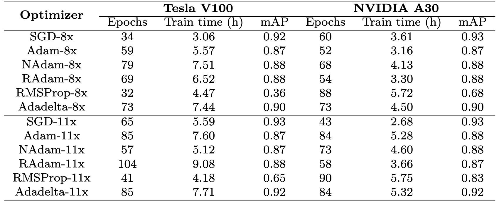

# yolo-optimizer-comparison


This repository contains the results of a comparative study of different optimizing algorithms used during the training phase with YOLO in the USV context using performance metrics. Additionally, it compares YOLOv8x with its most recent equivalent version at the time, YOLO11x; and finally, it compares these same algorithms for these two versions but applying the convergence-based early stopping technique.

For this study we have followed these steps:

## 1. Installation

### Python dependencies

The best way to install python dependencies is by using a virtual environment, to do so:

```bash
$ sudo apt install virtualenv
$ virtualenv -p python3 venv
$ source venv/bin/activate
$ pip install numpy
```
### Requirements 

To run the code, you will need to install the following dependencies beforehand:

* Ultralytics >=8.3.20
* Python
* Pytorch 
* Clearml 1.18.0 

To deactivate virtualenv, do by:

```bash
$ deactivate
```

## 2. Training

### Dataset structure 

To train the model, a format, in this case YOLOv8, must be followed and the training data set must be divided into three subdirectories.  
The data used to train the custom model in the USV context can be found here: [Datasense@CRAS](https://rdm.inesctec.pt/lv/dataset/nis-2022-001).  
An example of the directory structure is shown below:

```
Datasense@CRAS/ │
              ├── train/ │
              │   ├── images/
              │   ├── image1.jpg
              │   ├── image2.jpg
              │   ├── .... (other image files)  
              │   └── labels/
              │   ├── label1.txt
              │   ├── label2.txt
              │   ├── .... (other label files)     
              ├── valid/ │
              │   ├── image1.jpg
              │   ├── image2.jpg
              │   ├── .... (other image files)
              │   └── labels/
              │   ├── label1.txt
              │   ├── label2.txt
              │   ├── .... (other label files) 
              ├── test/ │
              │   ├── image1.jpg
              │   ├── image2.jpg
              │   ├── .... (other image files)
              │   └── labels/
              │   ├── label1.txt
              │   ├── label2.txt
              │   ├── .... (other label files) 
              └── data.yaml 
```

### CLI to Train the model
To run or launch the training you will need:

```bash
$ yolo detect train data=/path/data.yaml model=yolov8n.pt epochs=150 imgsz=640 plots=True save=True 
```
### Some examples of trained model predictions

<table>
  <tr>
    <td></td>
    <td></td>
  </tr>
  <tr>
    <td></td>
    <td></td>
  </tr>
</table>

## 3. Evaluation
### Performance metrics of each optimizer algorithms based on YOLOv8x


### Comparison between different optimizer algorithms YOLOv8x and YOLO11x models


### Comparison between optimizers on three GPUs based on early stopping with convergence

  

### Computational resource usage with and without Early Stopping  


## 4. Publications

In process "A Comparative Study of Optimizer Algorithms for YOLO-Based Object Detection in USVs"

## 5. Acknowledgements

J.L.M. thanks the National Secretariat of Science, Technology and Innovation (SENACYT) of Panama for financial support during the completion of his PhD.
